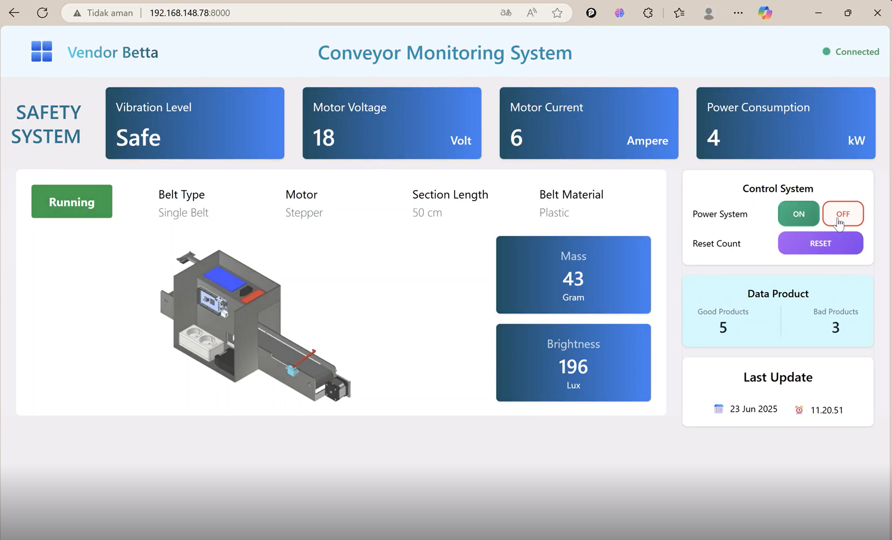
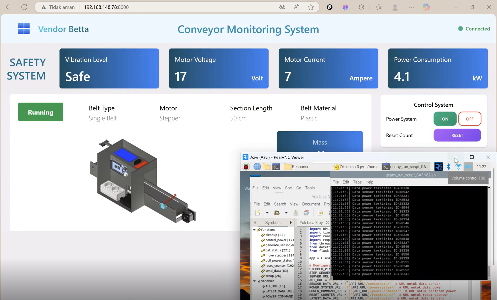

# Conveyor Belt Monitoring System

Sistem monitoring dan kontrol conveyor belt berbasis web yang terintegrasi dengan hardware Raspberry Pi untuk monitoring real-time dan quality control produk industri.

## Tampilan Dashboard

*Tampilan dashboard sebelum terhubung Raspi*


*Tampilan dashboard sebelum terhubung Raspi*


*Pengiriman Data dari Rasberry PI*

## 🚀 Fitur Utama

### Real-time Monitoring
- **Status Conveyor**: Monitoring status ON/OFF conveyor belt
- **Data Sensor**: Monitoring massa dan brightness produk
- **Safety System**: Monitoring getaran, voltage, current, dan power consumption
- **Product Counting**: Perhitungan otomatis produk baik dan buruk
- **Connection Status**: Indikator koneksi real-time dengan hardware

### Control System
- **Remote Power Control**: Kontrol power conveyor via Raspberry Pi
- **Override Mode**: Mode override dengan auto-resume untuk keamanan
- **Reset Counter**: Reset counter produk dengan satu klik
- **Safety Monitoring**: Sistem keamanan otomatis berdasarkan parameter sensor

### Dashboard Features
- **Responsive Design**: Tampilan optimal untuk desktop dan mobile
- **Real-time Updates**: Update data secara real-time menggunakan JavaScript
- **Visual Indicators**: Indikator visual untuk status sistem
- **Interactive Controls**: Kontrol interaktif untuk manajemen power

## 🛠️ Teknologi yang Digunakan

- **Backend**: Django 5.2 + Django REST Framework
- **Database**: PostgreSQL (production) / SQLite3 (development)
- **Frontend**: HTML5 + Tailwind CSS + JavaScript
- **Hardware**: Raspberry Pi integration
- **API**: RESTful API untuk komunikasi dengan hardware

## 📋 Persyaratan Sistem

- Python 3.8+
- Django 5.2
- PostgreSQL 12+ (untuk production)
- Raspberry Pi dengan sensor yang terkonfigurasi
- Network connection untuk komunikasi dengan Raspberry Pi

## 🔧 Instalasi

### 1. Clone Repository
```bash
git clone <repository-url>
cd sensor_api
```

### 2. Setup Virtual Environment
```bash
python -m venv venv
source venv/bin/activate  # Linux/Mac
# atau
venv\Scripts\activate     # Windows
```

### 3. Install Dependencies
```bash
pip install django==5.2
pip install djangorestframework
pip install psycopg2-binary  # untuk PostgreSQL
pip install requests
```

### 4. Konfigurasi Database

#### Untuk Development (SQLite):
Tidak perlu konfigurasi tambahan, SQLite akan dibuat otomatis.

#### Untuk Production (PostgreSQL):
1. Buat database PostgreSQL:
```sql
CREATE DATABASE sensor_system;
CREATE USER postgres WITH PASSWORD 'your_password';
GRANT ALL PRIVILEGES ON DATABASE sensor_system TO postgres;
```

2. Update konfigurasi di `sensor_api/settings.py`:
```python
DATABASES = {
    'default': {
        'ENGINE': 'django.db.backends.postgresql',
        'NAME': 'sensor_system',
        'USER': 'postgres',
        'PASSWORD': 'your_password',
        'HOST': 'localhost',
        'PORT': '5432',
    }
}
```

### 5. Migrasi Database
```bash
python manage.py makemigrations
python manage.py migrate
```

### 6. Jalankan Server
```bash
python manage.py runserver 0.0.0.0:8000
```

## 🔌 Konfigurasi Hardware

### Raspberry Pi Setup
1. Pastikan Raspberry Pi terhubung ke network yang sama
2. Update IP address Raspberry Pi di `sensor/views.py`:
```python
RASPBERRY_PI_URL = "http://YOUR_RASPBERRY_PI_IP:8000"
```

### Sensor Configuration
Sistem mendukung sensor berikut:
- **Load Cell**: Untuk pengukuran massa produk
- **Light Sensor**: Untuk pengukuran brightness
- **Vibration Sensor**: Untuk monitoring getaran conveyor
- **Current/Voltage Sensor**: Untuk monitoring parameter listrik motor

## 📡 API Endpoints

### Core Endpoints
- `GET /` - Dashboard monitoring
- `GET /api/` - API root dengan semua endpoints

### Data Management
- `GET/POST /api/powersystem/` - Data sistem power
- `GET/POST /api/sensordata/` - Data sensor
- `GET /api/latest-data/` - Data terbaru

### Control Endpoints
- `POST /api/power-command/` - Kontrol power conveyor
- `POST /api/resetcount/` - Reset counter produk
- `POST /api/activate-override/` - Aktivasi mode override

### Example API Usage

#### Mengirim Data Sensor
```bash
curl -X POST http://localhost:8000/api/sensordata/ \
  -H "Content-Type: application/json" \
  -d '{
    "mass": 150.5,
    "brightness": 800,
    "status_product": true,
    "voltage": 220,
    "current": 2.5,
    "power_consumption": 0.55,
    "vibration_level": 3.2
  }'
```

#### Kontrol Power
```bash
curl -X POST http://localhost:8000/api/power-command/ \
  -H "Content-Type: application/json" \
  -d '{"status": 1}'  # 1 = ON, 0 = OFF
```

## 🗂️ Struktur Project

```
sensor_api/
├── manage.py                 # Django management script
├── db.sqlite3               # SQLite database (development)
├── sensor/                  # Main application
│   ├── models.py           # Database models
│   ├── views.py            # API views dan business logic
│   ├── serializers.py      # API serializers
│   ├── urls.py             # URL routing
│   ├── admin.py            # Django admin configuration
│   ├── templates/          # HTML templates
│   │   └── monitoring/
│   │       └── dashboard.html
│   └── migrations/         # Database migrations
└── sensor_api/             # Project configuration
    ├── settings.py         # Django settings
    ├── urls.py             # Main URL configuration
    ├── wsgi.py             # WSGI configuration
    └── asgi.py             # ASGI configuration
```

## 🔒 Safety Features

### Override Mode
- **Auto-activation**: Sistem otomatis masuk override mode saat terdeteksi kondisi tidak aman
- **Manual activation**: Override dapat diaktifkan manual melalui API
- **Auto-resume**: Sistem otomatis kembali normal setelah periode tertentu
- **Safety lock**: Mencegah aktivasi sistem saat override mode aktif

### Monitoring Parameters
- **Vibration Level**: Threshold < 5 untuk kondisi aman
- **Voltage Monitoring**: Monitoring tegangan motor real-time
- **Current Monitoring**: Monitoring arus motor untuk deteksi overload
- **Power Consumption**: Monitoring konsumsi daya untuk efisiensi

## 📊 Database Schema

### PowerSystem Model
```python
class PowerSystem(models.Model):
    id = models.BigAutoField(primary_key=True)
    timestamp = models.DateTimeField()
    status = models.BooleanField()  # ON/OFF status
    voltage = models.FloatField()   # Motor voltage
    vibration = models.BooleanField()  # Vibration safety status
    current = models.FloatField()   # Motor current
    power_consumption = models.FloatField()  # Power consumption
```

### SensorData Model
```python
class SensorData(models.Model):
    id = models.AutoField(primary_key=True)
    timestamp = models.DateTimeField()
    mass = models.FloatField()      # Product mass
    brightness = models.FloatField()  # Light sensor reading
    status_product = models.BooleanField()  # Product quality status
```

## 🚨 Troubleshooting

### Common Issues

1. **Connection Error dengan Raspberry Pi**
   - Periksa IP address dan port Raspberry Pi
   - Pastikan Raspberry Pi service berjalan
   - Periksa koneksi network

2. **Database Connection Error**
   - Periksa konfigurasi database di settings.py
   - Pastikan PostgreSQL service berjalan
   - Periksa credentials database

3. **Sensor Data Tidak Update**
   - Periksa koneksi sensor ke Raspberry Pi
   - Periksa log error di console browser
   - Pastikan API endpoints dapat diakses

### Debug Mode
Untuk development, pastikan `DEBUG = True` di settings.py untuk melihat error detail.

## 📝 Logging

Sistem menggunakan Python logging untuk tracking:
- API requests dan responses
- Hardware communication status
- Error handling dan debugging
- Override mode activities

## 🤝 Contributing

1. Fork repository
2. Buat feature branch (`git checkout -b feature/AmazingFeature`)
3. Commit changes (`git commit -m 'Add some AmazingFeature'`)
4. Push ke branch (`git push origin feature/AmazingFeature`)
5. Buat Pull Request

## 📄 License

Project ini menggunakan MIT License. Lihat file `LICENSE` untuk detail.

## 👥 Tim Pengembang

- **Backend Development**: Django REST API
- **Frontend Development**: Responsive dashboard
- **Hardware Integration**: Raspberry Pi & sensors
- **Database Design**: PostgreSQL schema
